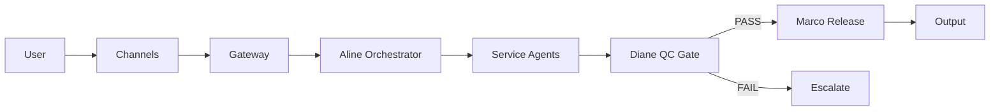

# OpenClaw + FirmOS Architecture

> Last updated: 2026-02-02

## Overview

**OpenClaw** is an AI-powered personal assistant platform with a multi-agent operating system (**FirmOS**) for professional services automation.

---

## Current Structure

```
openclaw/
├── src/                      # Core platform (~2500 files)
│   ├── gateway/              # WebSocket server + handlers
│   ├── agents/               # Agent runtime + tools
│   ├── cli/                  # CLI commands
│   ├── channels/             # Channel adapters
│   └── infra/                # Infrastructure utilities
├── packages/                 # FirmOS packages (8)
│   ├── firmos-core/          # Types + config loader
│   ├── firmos-agents/        # 11 agent definitions
│   ├── firmos-policies/      # Policy enforcement
│   ├── firmos-programs/      # QC gates, release workflow
│   ├── firmos-packs/         # Malta + Rwanda packs
│   ├── firmos-tools/         # Tool registry
│   ├── moltbot-official/     # Moltbot package
│   └── clawdbot/             # Clawdbot package
├── modules/                  # Business logic modules (extraction layer)
│   ├── routing/              # Request routing
│   ├── qc_gates/             # Diane QC gate (re-exports from programs)
│   ├── release_gates/        # Marco release gate (re-exports from programs)
│   ├── template_factory/     # Template management (re-exports from programs)
│   ├── evidence/             # Evidence collection
│   ├── audit_log/            # Audit trail
│   └── case_mgmt/            # Case management
├── firmos/                   # FirmOS configuration (YAML catalogs + policies)
│   ├── catalogs/             # service_catalog, agents_catalog, jurisdictions
│   └── policies/             # gate_policy, autonomy_policy, evidence_policy
├── schemas/                  # JSON schemas for YAML validation
├── apps/                     # Applications
│   ├── dashboard/            # Vite + React dashboard
│   ├── firmos/               # FirmOS control app
│   ├── api/                  # API server
│   └── [native apps]         # macOS, iOS, Android
├── ui/                       # Lit-based Control UI
├── channels/                 # 19 messaging channels
├── extensions/               # 30 extension packages
├── skills/                   # 60 skills (8 FirmOS)
├── supabase/                 # DB + edge functions
└── .github/workflows/        # 7 CI workflows
```

---

## FirmOS Agent System

### Governance Tier

| Agent | Role | Autonomy |
|-------|------|----------|
| **Aline** | Orchestrator | Routes tasks, manages priorities |
| **Marco** | Governor | Policy enforcement, release control |
| **Diane** | Guardian | QC gates, ethics, risk validation |

### Global Engine

| Agent | Service | Skill |
|-------|---------|-------|
| **Patrick** | Audit Lead | `firmos-audit` |
| **Sofia** | Accounting | `firmos-accounting` |
| **James** | Advisory/CFO | `firmos-advisory` |
| **Fatima** | Risk & Controls | `firmos-risk` |

### Jurisdiction Engines

| Engine | Agents | Packs |
|--------|--------|-------|
| **Malta (MT)** | Matthew (Tax), Claire (CSP) | `firmos-packs/malta` |
| **Rwanda (RW)** | Emmanuel (Tax), Chantal (Notary) | `firmos-packs/rwanda` |

---

## Data Flow



---

## Tech Stack

| Layer | Technology |
|-------|------------|
| Frontend | Vite + React (dashboard), Lit (Control UI) |
| Backend | Node.js 22+, Express, WebSocket |
| Database | Supabase (Postgres + edge functions) |
| Auth | Supabase Google OAuth |
| Build | pnpm 10, TypeScript 5.8, oxlint |
| Test | vitest (70% coverage threshold) |
| CI | GitHub Actions (7 workflows) |
| Deploy | Local (default ws://127.0.0.1:18789), Cloudflare Pages |

---

## Module Boundaries

### What Belongs Where

| Path | Contents | Ownership |
|------|----------|-----------|
| `packages/firmos-*` | Runtime code, types, tools | FirmOS team |
| `skills/firmos-*` | Agent skill definitions (SKILL.md) | Domain experts |
| `apps/dashboard` | UI, views, components | Frontend team |
| `src/gateway` | WebSocket server, protocol | Platform team |
| `supabase/` | DB schema, edge functions | Backend team |

### Rules

1. **No direct src/ imports from packages/** — use published exports
2. **Skills are declarative** — no runtime code in SKILL.md
3. **Policies are in firmos-policies** — not scattered
4. **Programs are in firmos-programs** — QC/release gates centralized

---

## Quality Gates

| Gate | Owner | Trigger |
|------|-------|---------|
| Diane QC | Guardian | Before any release |
| Marco Release | Governor | After Diane PASS |
| CI Lint | Automated | Every PR |
| CI Tests | Automated | Every PR |

---

## Commands Reference

```bash
# Development
pnpm gateway:watch     # Start gateway dev server
pnpm ui:dev            # Start Control UI dev

# Quality
pnpm lint              # oxlint type-aware
pnpm build             # Full build
pnpm test              # Unit tests

# FirmOS
cd packages/firmos-programs && pnpm test  # FirmOS tests
```
