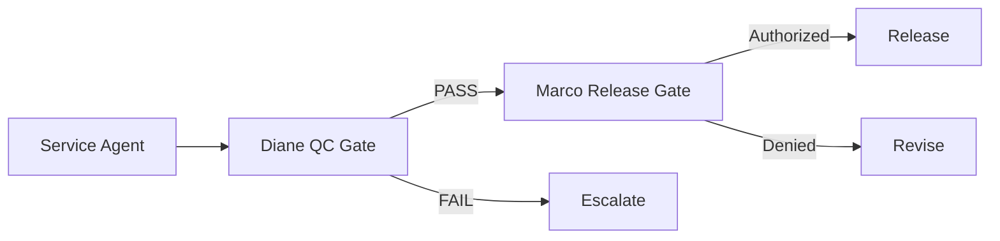

# FirmOS Governance Guide

> Last updated: 2026-02-02

## Overview

FirmOS enforces governance through a two-gate system controlled by specialized agents.

---

## Gate System



---

## QC Gate (Diane)

**Owner**: `diane` (Guardian agent)

### Required Checks

| Check | Description |
|-------|-------------|
| `completeness` | All required fields populated |
| `accuracy` | Calculations verified |
| `evidence` | Supporting evidence attached |
| `compliance` | Regulatory requirements met |
| `ethics` | No ethical concerns |

### Outcomes

| Outcome | Action |
|---------|--------|
| `PASS` | Work proceeds to release gate |
| `FAIL` | Work returned for revision |
| `ESCALATE` | Elevated to human review |

### Code Usage

```typescript
import { isQCRequired, getRequiredChecks } from '@firmos/modules/qc_gates';

// Check if agent needs QC
if (isQCRequired(agent.autonomy)) {
    const checks = getRequiredChecks();
    // Run QC with checks...
}
```

---

## Release Gate (Marco)

**Owner**: `marco` (Governor agent)

### Authorization Levels

| Level | Conditions |
|-------|------------|
| `standard` | QC passed, risk ≤ medium |
| `elevated` | QC passed, risk = high, human_check passed |
| `critical` | QC passed, requires partner AND client approval |

### Code Usage

```typescript
import { isReleaseRequired, getAuthorizationLevels } from '@firmos/modules/release_gates';

// Check if release gate applies
if (isReleaseRequired(agent.autonomy)) {
    const levels = getAuthorizationLevels();
    // Determine auth level and proceed...
}
```

---

## Autonomy Levels

| Level | QC Required | Release Required |
|-------|-------------|------------------|
| `AUTO` | No | No |
| `AUTO+CHECK` | Yes | No |
| `ESCALATE` | Yes | Yes |

---

## Configuration Files

| File | Purpose |
|------|---------|
| `firmos/catalogs/agents_catalog.yaml` | Agent definitions + autonomy levels |
| `firmos/catalogs/service_catalog.yaml` | Service → agent mapping |
| `firmos/policies/gate_policy.yaml` | QC + release gate rules |
| `firmos/policies/autonomy_policy.yaml` | Autonomy tier definitions |

---

## Best Practices

1. **Default to ESCALATE** for new agents until validated
2. **Always attach evidence** for regulated work
3. **Log all gate decisions** in audit trail
4. **Never bypass gates** in production code
