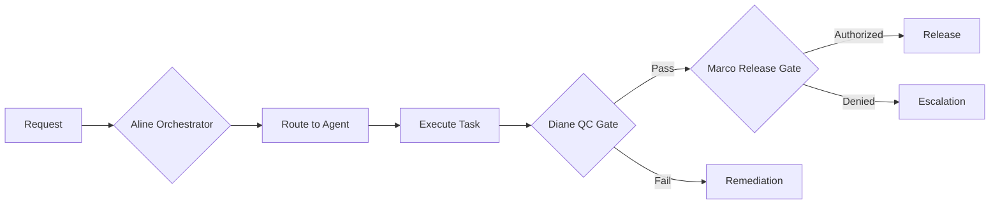

# FirmOS Architecture

> **Version**: 1.0  
> **Last Updated**: 2026-02-02

## Overview

FirmOS is a multi-agent governance framework for professional services automation. It provides structured task orchestration, quality control gates, and pack-scoped service delivery.

## Core Concepts

### Agents
11 specialized AI agents, each with defined roles:

| Agent | Role | Domain |
|-------|------|--------|
| Aline | Orchestrator | Global |
| Marco | Governor (policy/release) | Global |
| Diane | Guardian (QC) | Global |
| Patrick, Sofia, James, Fatima | Service Delivery | Global |
| Matthew, Claire | Malta Engine | Malta |
| Emmanuel, Chantal | Rwanda Engine | Rwanda |

### Packs (Jurisdiction Separation)
- `GLOBAL` — Cross-jurisdiction shared resources
- `MT_TAX`, `MT_CSP_MBR` — Malta-specific
- `RW_TAX`, `RW_PRIVATE_NOTARY` — Rwanda-specific

**Rule**: Malta agents cannot access Rwanda packs and vice versa.

### Services
8 executable service programs (4 global, 2 Malta, 2 Rwanda) with:
- Phased task graphs
- Autonomy tiers (L1-L5)
- Evidence requirements
- QC gate triggers

## Directory Structure

```
firmos/
├── apps/                    # Dashboard, API
├── catalogs/                # YAML configurations
│   ├── agents_catalog.yaml
│   ├── service_catalog.yaml
│   └── skills_matrix.yaml
├── modules/                 # Runtime modules
│   ├── audit_log/
│   ├── case_mgmt/
│   ├── evidence/
│   ├── qc_gates/
│   ├── release_gates/
│   ├── routing/
│   └── template_factory/
├── packages/                # Core logic
│   ├── agents/
│   ├── core/
│   ├── policies/
│   ├── programs/
│   └── tools/
├── schemas/                 # JSONSchema + Zod validation
└── tests/                   # Vitest test suites
```

## Governance Flow



## Key Modules

### Config Loader (`packages/core/config-loader.ts`)
- Loads YAML catalogs at runtime
- Provides typed access: `getAgent()`, `getService()`, `canAccessPack()`
- Caches for performance

### QC Gate Runner (`packages/programs/qc-gate-runner.ts`)
- Diane's quality control checks
- Built-in: Evidence Coverage, Pack Boundary, Output Completeness
- Extensible via `registerQCCheck()`

### Release Gate Workflow (`packages/programs/release-gate-workflow.ts`)
- Marco's authorization workflow
- States: pending → qc_in_progress → authorized/denied → executed
- Rollback support

### Template Factory (`packages/programs/template-factory.ts`)
- Pack-scoped template management
- Version control (semver)
- QC-gated publishing

## Validation

YAML catalogs are validated at:
1. **CI**: `firmos-validate` job runs on every PR
2. **Runtime**: `loadConfig()` validates on first access
3. **Manual**: `npx tsx schemas/validation.ts catalogs`

## Testing

```bash
cd firmos
pnpm test          # Run all tests
pnpm test:watch    # Watch mode
```

Test coverage includes:
- Pack separation rules
- Agent skill assignments
- Service program validation
- Config schema compliance

## Related Docs

- [Governance](./governance.md) — Policy rules and escalation
- [Onboarding](./onboarding.md) — Developer setup guide
- [Runbook](./runbook.md) — Operations playbook
